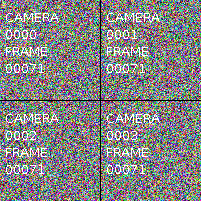

# Pravega Video Samples

## Overview



This project demonstrates methods to store, process, and read video with Pravega and Flink.

The Pravega Event API is limited to 1 MiB events. 
To allow storage of objects larger than 1 MiB, such as video frames and images,
objects must be split into chunks of 1 MiB or less.

The logical object that is generally stored for video is the video frame.
In this example, the [VideoFrame](flinkprocessor/src/main/java/io/pravega/example/videoprocessor/VideoFrame.java) 
class stores a video frame.
It has a timestamp and a byte array containing a PNG-encoded image.
The size of the image is limited only by the JVM which limits arrays to 2 GiB.

Note: If you are storing a video **transport stream**, such as Real-time Transport Protocol, 
HTTP Live Streaming, or MPEG Transport Stream (broadcast video), these are already packetized into
small packets of 188 or 1500 bytes. These can be stored in Pravega as-is. However, due to the complexity
involved in decoding such transport streams, it is often easier to store individual video frames
as ordinary images as described in this project.

## Writing Video to Pravega

Before a `VideoFrame` instance can be written to Pravega, it is split into
one or more [ChunkedVideoFrame](flinkprocessor/src/main/java/io/pravega/example/videoprocessor/ChunkedVideoFrame.java) 
instances.
A `ChunkedVideoFrame` is a subclass of `VideoFrame` and it adds two 16-bit integers,
`ChunkIndex` and `FinalChunkIndex`.
`ChunkIndex` is a 0-based counter for this `ChunkedVideoFrame` within the `VideoFrame`.
`FinalChunkIndex` is the value of the final/maximum `ChunkIndex` and is equal to the number
of chunks minus 1.
For example, a 1.5 MiB image can be split into three 0.5 MiB chunks with {ChunkIndex, FinalChunkIndex} pairs of
{0,2}, {1,2}, {2,2}.

As implemented in `VideoFrameChunker`, the first chunk will contain the first 0.5 MB of the image, 
the second chunk will contain the second 0.5 MB of the image,
and so on. The last chunk may be smaller than the other chunks.

`ChunkedVideoFrame` instances are then serialized into JSON using `ChunkedVideoFrameSerializationSchema` and
it is this JSON that is written to the Pravega stream.
JSON is widely supported, simple to use, and easy to inspect.
However, because it requires base-64 encoding for byte arrays, it has a 33% storage overhead
compared to more efficient encodings such as Avro and Protobuf.

If a non-transactional Pravega writer were to fail while writing chunks of video, this could result in only some
of the chunks being written. Although this can easily be detected by the reassembly process, this could cause high
memory usage for the state of the reassembly process. To avoid this, Pravega transactions can be used to keep
chunks for the same image within a single transaction.

For an example of a Flink video writer job, see 
[VideoDataGeneratorJob](flinkprocessor/src/main/java/io/pravega/example/videoprocessor/VideoDataGeneratorJob.java).

## Reading Video from Pravega

To read video frames from Pravega, the Pravega reader first reads the JSON-encoded `ChunkedVideoFrame`
and deserializes it.

Next, a series of Flink operations is performed.
```java
DataStream<VideoFrame> videoFrames = chunkedVideoFrames
        .keyBy("camera", "ssrc", "timestamp", "frameNumber")
        .window(ProcessingTimeSessionWindows.withGap(Time.seconds(10)))
        .trigger(new ChunkedVideoFrameTrigger())
        .process(new ChunkedVideoFrameReassembler());
```

The `keyBy` function defines the attributes of `ChunkedVideoFrame` that uniquely identify a single frame.
As new events are read from Pravega from multiple Flink tasks in parallel, events with identical
values of these attributes will be grouped together and handled by the same task.

The `window` function applies a **session** window to each group of `ChunkedVideoFrame`.
Each session window will automatically timeout after 10 seconds of inactivity. This means that if
a non-transactional Pravega writer wrote only 2 of 3 chunks, these chunks would be purged from the
Flink state after 10 seconds, thus freeing memory.

The `ChunkedVideoFrameTrigger` trigger function simply watches for
`ChunkedVideoFrame` instances where `ChunkIndex` equals `FinalChunkIndex`. 
When this occurs, it returns
`FIRE_AND_PURGE` which tells it to call the `process` function and then it purges the
video frame from the state. 
Under normal conditions, the session window 10-second timeout never occurs
because `ChunkedVideoFrameTrigger` purges the state immediately upon the final chunk being received.

The `ChunkedVideoFrameReassembler` process function concatenates the byte arrays from all `ChunkedVideoFrame` instances
and outputs `VideoFrame` instances.
It checks for missing chunks and out-of-order chunks. 
It also validates that the SHA-1 hash of the data matches the hash calculated when it was written to Pravega.
Note that this check can be removed for high-throughput applications as Pravega and Flink
have additional layers of data consistency checks.

For an example of a Flink video reader job, see 
[VideoReaderJob](flinkprocessor/src/main/java/io/pravega/example/videoprocessor/VideoReaderJob.java).

For a complete job that reads video from Pravega, processes it, and writes the processed video,
see [MultiVideoGridJob](flinkprocessor/src/main/java/io/pravega/example/videoprocessor/MultiVideoGridJob.java).

## Components

- Pravega: Pravega provides a new storage abstraction - a stream - for continuous and unbounded data. 
  A Pravega stream is a durable, elastic, append-only, unbounded sequence of bytes that has good performance and strong consistency.

  Pravega provides dynamic scaling that can increase and decrease parallelism to automatically respond
  to changes in the event rate.

  For more information, see <http://pravega.io>.

- Flink: Apache Flink® is an open-source stream processing framework for distributed, high-performing, always-available, and accurate data streaming applications.
  See <https://flink.apache.org> for more information.

- Docker: This demo uses Docker and Docker Compose to greatly simplify the deployment of the various
  components on Linux and/or Windows servers, desktops, or even laptops.
  
  For more information, see <https://en.wikipedia.org/wiki/Docker_(software)>.

## Building and Running the Video Samples

In the steps below, sections noted with **(Nautilus SDK Desktop)** should only be performed
in a Nautilus SDK Desktop in a Kubernetes deployment of Nautilus.
Sections noted with **(Local)** should only be performed in a local workstation deployment
of Pravega.

### Download this Repository

```
cd
git clone https://github.com/pravega/video-samples
cd video-samples
```

### (Local) Install Operating System

Install Ubuntu 16.04 LTS. Other operating systems can also be used but the commands below have only been tested
on this version.

### (Local) Install Java 8

```
apt-get install openjdk-8-jdk
```

### (Local, Optional) Install IntelliJ

Install from <https://www.jetbrains.com/idea>.
Enable the Lombok plugin.
Enable Annotations (settings -> build, execution, deployment, -> compiler -> annotation processors).

### (Local) Install Docker and Docker Compose

See <https://docs.docker.com/install/linux/docker-ce/ubuntu/>
and <https://docs.docker.com/compose/install/>.

### (Local) Run Pravega

This will run a development instance of Pravega locally.
Note that the default *standalone* Pravega used for development is likely insufficient for testing video because
it stores all data in memory and quickly runs out of memory.
Using the procedure below, all data will be stored in a small HDFS cluster in Docker.

In the command below, replace x.x.x.x with the IP address of a local network interface such as eth0.

```
cd
git clone https://github.com/pravega/pravega
cd pravega
git checkout r0.5
./gradlew docker
cd docker/compose
export HOST_IP=x.x.x.x
docker-compose up -d
```

You can view the Pravega logs with `docker-compose logs --follow`.

You can view the stream files stored on HDFS with `docker-compose exec hdfs hdfs dfs -ls -h -R /`.

## (Local) Install Pravega Client and Pravega Flink Connector Libraries

This step is required when using pre-release versions of Pravega and/or Nautilus.
It will install required libraries in the local Maven repository.
This can be skipped in Nautilus SDK Desktop as it has already been performed.

```
cd
git clone https://github.com/pravega/pravega
pushd pravega
git checkout r0.5
./gradlew install
popd
git clone https://github.com/pravega/flink-connectors
pushd flink-connectors
git checkout r0.5
./gradlew install
popd
```

### (Nautilus SDK Desktop) Enable Nautilus Authentication

Accessing Pravega on Nautilus requires authentication provided by a credentials jar file.
This file is available in your local Maven repository.
If necessary, edit the file `gradle.properties` to include the following line.

```
includePravegaCredentials=true
```

## Running the Examples

Run the Flink video data generator job using the following parameters:
```
--jobClass
io.pravega.example.videoprocessor.VideoDataGeneratorJob
--controller
tcp://127.0.0.1:9090
--output-minNumSegments
6
--output-stream
examples/video1
```

Note: In Nautilus, use the controller `tcp://nautilus-pravega-controller.nautilus-pravega.svc.cluster.local:9090`.

Next, run a streaming Flink job that reads all video streams and combines them into a single video stream
where each image is composed of the input images in a square grid. 
Run the Flink app with the following parameters:
```
--jobClass
io.pravega.example.videoprocessor.MultiVideoGridJob
--controller
tcp://127.0.0.1:9090
--parallelism
2
--output-minNumSegments
6
--input-stream
examples/video1
--output-stream
examples/grid1
```

Run the Flink video reader job using the following parameters:
```
--jobClass
io.pravega.example.videoprocessor.VideoReaderJob
--controller
tcp://127.0.0.1:9090
--parallelism
2
--input-stream
examples/grid1
```
This will write a subset of images to `/tmp/camera*.png`.

Below shows the example output from 4 camera feeds.
Note that image backgrounds are filled with random bytes to make them incompressible for testing purposes.


# References

- <http://pravega.io/>

# Appendix

## Memory Usage of the Flink Video Reader

A Flink task must store in memory all `ChunkedVideoFrame` instances which it has read until the final chunk for that
frame has been read or a session timeout occurs. A single Flink task that is reading from multiple Pravega segments
may receive chunks from interleaved frames, this requiring multiple partial frames to be buffered. To avoid out-of-memory
errors, each Flink task should have enough memory to buffer its share of Pravega segments.
For example, if you have 12 Pravega segments and 3 Flink reader tasks, you should account for 4 frames to be buffered
for each Flink reader task.

If you are using a non-transactional writer, you should also account for additional frames to be buffered.
If interruptions are rare, a single additional frame should be sufficient.
