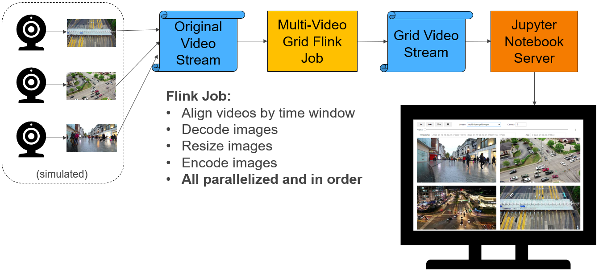

# Pravega Video Samples

## Overview



This project demonstrates methods to store, process, and read video with Pravega and Flink.

## Components

- Pravega: Pravega provides a new storage abstraction - a stream - for continuous and unbounded data. 
  A Pravega stream is a durable, elastic, append-only, unbounded sequence of bytes that has good performance and strong consistency.

  Pravega provides dynamic scaling that can increase and decrease parallelism to automatically respond
  to changes in the event rate.

  For more information, see <http://pravega.io>.

- Flink: Apache Flink® is an open-source stream processing framework for distributed, high-performing, always-available, and accurate data streaming applications.
  See <https://flink.apache.org> for more information.

- Docker: This demo uses Docker and Docker Compose to greatly simplify the deployment of the various
  components on Linux and/or Windows servers, desktops, or even laptops.
  
  For more information, see <https://en.wikipedia.org/wiki/Docker_(software)>.

## Building and Running the Video Samples

In the steps below, sections noted with **(Nautilus SDK Desktop)** apply only to a
Nautilus SDK Desktop in a Kubernetes deployment of Nautilus.
Sections noted with **(Local)** apply to a local workstation deployment of Pravega (standalone or Docker).
Sections noted with **(External)** apply to a local workstation running IntelliJ that
connects to Pravega running in an external Kubernetes deployment of Nautilus.

### Download this Repository

```
cd
git clone https://github.com/pravega/video-samples
cd video-samples
```

### (Local, External) Install Operating System

Install Ubuntu 18.04 LTS. Other operating systems can also be used but the commands below have only been tested
on this version.

### (Local, External) Install Java 8

```
apt-get install openjdk-8-jdk
```

### (Local, External, Optional) Install IntelliJ

Install from <https://www.jetbrains.com/idea>.
Enable the Lombok plugin.
Enable Annotations (settings -> build, execution, deployment, -> compiler -> annotation processors).

### (Local) Install Docker and Docker Compose

See <https://docs.docker.com/install/linux/docker-ce/ubuntu/>
and <https://docs.docker.com/compose/install/>.

### (Local) Run Pravega

This will run a development instance of Pravega locally.
Note that the default *standalone* Pravega used for development is likely insufficient for testing video because
it stores all data in memory and quickly runs out of memory.
Using the procedure below, all data will be stored in a small HDFS cluster in Docker.

In the command below, replace x.x.x.x with the IP address of a local network interface such as eth0.

```
cd
git clone https://github.com/pravega/pravega
cd pravega
git checkout cd6bfe7
./gradlew docker
cd docker/compose
export HOST_IP=x.x.x.x
docker-compose up -d
```

You must also create the Pravega scope. This can be performed using the REST API.
```
curl -X POST -H "Content-Type: application/json" -d '{"scopeName":"examples"}' http://localhost:10080/v1/scopes
```

You can view the Pravega logs with `docker-compose logs --follow`.

You can view the stream files stored on HDFS with `docker-compose exec hdfs hdfs dfs -ls -h -R /`.

#### Alternative for low-memory systems

If your system does not have enough memory to run all of the Pravega containers, you may run
the standalone container using the following commands.

```
export HOST_IP=x.x.x.x
docker run -it --rm -e HOST_IP -p 9090:9090 -p 10080:9091 -p 12345:12345 pravega/pravega:latest standalone
curl -X POST -H "Content-Type: application/json" -d '{"scopeName":"examples"}' http://localhost:10080/v1/scopes
```

### (Local only) Install Pravega Client and Pravega Flink Connector Libraries

This step is required when using pre-release versions of Pravega and/or Nautilus.
It will install required libraries in the local Maven repository.
This can be skipped in Nautilus SDK Desktop as it has already been performed.
This can also be skipped with 0.13-W11 release

```
cd
git clone https://github.com/pravega/pravega
pushd pravega
git checkout cd6bfe7
./gradlew install
popd
git clone https://github.com/pravega/flink-connectors
pushd flink-connectors
git checkout 9e3fa4d74e6648168047d312d4c9a607990cf56d
./gradlew install
popd
```

### (Nautilus SDK Desktop) Enable Nautilus Authentication

Accessing Pravega on Nautilus requires authentication provided by a credentials jar file.
This file is available in your local Maven repository.
If necessary, edit the file `gradle.properties` to include the following line.

```
includePravegaCredentials=true
```

Obtain the Pravega authentication credentials.
```
PROJECT=examples ; kubectl get secret ${PROJECT}-pravega -n ${PROJECT} -o jsonpath="{.data.keycloak\.json}" | base64 -d | python -m json.tool > ~/keycloak.json
chmod go-rw ${HOME}/keycloak.json
```

When running the example applications, you must set the following environment variables.
This can be done by setting the IntelliJ run configurations. If you set this in IntelliJ,
you must manually replace `${HOME}` with your actual home directory.
```
export pravega_client_auth_method=Bearer
export pravega_client_auth_loadDynamic=true
export KEYCLOAK_SERVICE_ACCOUNT_FILE=${HOME}/keycloak.json
```

### Determine the Pravega Controller URL

- Local:
  `tcp://127.0.0.1:9090`

- Nautilus SDK Desktop or a Flink job running in Nautilus:
  `tcp://nautilus-pravega-controller.nautilus-pravega.svc.cluster.local:9090`

- External:
  Run the following command and find the external FQDN in the HOSTS column:
  `kubectl get -n nautilus-pravega ing/pravega-controller`
  The Pravega Controller URL will be `tls://pravega-controller.FQDN:443`

### Running the Examples in IntelliJ

Run the Flink `VideoDataGeneratorJob` using the following parameters:
```
--controller
tcp://127.0.0.1:9090
--output-minNumSegments
6
--output-stream
examples/video1
```

Next, run a streaming Flink job that reads all video streams and combines them into a single video stream
where each image is composed of the input images in a square grid. 
Run the Flink `MultiVideoGridJob` with the following parameters:
```
--controller
tcp://127.0.0.1:9090
--parallelism
2
--output-minNumSegments
6
--input-stream
examples/video1
--output-stream
examples/grid1
```

Run the Flink `VideoReaderJob` using the following parameters:
```
--jobClass
io.pravega.example.videoprocessor.VideoReaderJob
--controller
tcp://127.0.0.1:9090
--parallelism
2
--input-stream
examples/grid1
```
This will write a subset of images to `/tmp/camera*.png`.

Below shows the example output from 4 camera feeds.
Note that image backgrounds are filled with random bytes to make them incompressible for testing purposes.


### Running the Examples in Nautilus

1. You must make the Maven repo in Nautilus available to your development workstation.
```
kubectl port-forward service/repo 9092:80 --namespace examples &
```

2. Build and publish your application JAR file.
```
./gradlew publish
```

3. Use Helm to start your Flink cluster and Flink applications.
```
scripts/deploy-k8s-components.sh
```

You can edit the file (charts/videoprocessor/values.yaml)[charts/videoprocessor/values.yaml]
to change various parameters such as the image dimensions, frames per second, and
number of cameras.
If you make changes to the source code or values.yaml, you may redeploy your application by repeating steps 2 to 3.
When you do this, you will see the current Flink applications save their state in a savepoint,
terminate, restart with the new JAR file, and resume from the last savepoint.

Note: You may use the script `scripts/uninstall.sh` to delete your Flink application and cluster.
This will also delete any savepoints.

### Viewing Logs in Nautilus

To troubleshoot a failed job, begin with the following command.
```
kubectl describe FlinkApplication -n examples multi-video-grid
```

When Flink applications write to stdout, stderr, or use slf4j logging, the output will be
available in one of several locations.

Output written by the driver (e.g. directly called by `main()`) will be available in the job's log
and can be viewed with the following command.
```
kubectl logs jobs/video-data-generator-app-v1-1 -n examples | less
```

Output written by operators (e.g. `map()`) will be available in the Flink task manager log
and can be viewed with the following command.
```
kubectl logs video-data-generator-taskmanager-0 -n examples -c server | less
```

When troubleshooting application issues, you should also review the Flink job manager log,
which can be viewed with the following command.
```
kubectl logs video-data-generator-jobmanager-0 -n examples -c server | less
```

You may want to use the kubectl logs `--follow`, `--tail`, and `--previous` flags.
You may also use the Kubernetes UI to view these logs.

## Camera Recorder Application

The Camera Recorder application reads images from a USB camera and writes them to
a Pravega stream.
It uses the same video encoding protocol as the Flink applications in this project.
It currently does not support chunking so each image must be less than 1 MB after JSON encoding.

To start it:
```
export PRAVEGA_CONTROLLER_URI=tcp://127.0.0.1:9090
export OUTPUT_STREAM_NAME=video1
./gradlew camera-recorder:run
```

See (AppConfiguration.java)[camera-recorder/src/main/java/io/pravega/example/camerarecorder/AppConfiguration.java]
for more options.

## Video Player Application

The Video Player application reads images from a Pravega stream and displays
them in a window on the screen.
It uses the same video encoding protocol as the Flink applications in this project.
It currently does not support images split over multiple chunks.

To start it:
```
export PRAVEGA_CONTROLLER_URI=tcp://127.0.0.1:9090
export INPUT_STREAM_NAME=grid1
export CAMERA=1000
./gradlew video-player:run
```

See (AppConfiguration.java)[video-player/src/main/java/io/pravega/example/videoplayer/AppConfiguration.java]
for more options.

# Video Chunking

The Pravega Event API is limited to 1 MiB events.
To allow storage of objects larger than 1 MiB, such as video frames and images,
objects must be split into chunks of 1 MiB or less.

The logical object that is generally stored for video is the video frame.
In this example, the [VideoFrame](flinkprocessor/src/main/java/io/pravega/example/videoprocessor/VideoFrame.java)
class stores a video frame.
It has a timestamp and a byte array containing a PNG-encoded image.
The size of the image is limited only by the JVM which limits arrays to 2 GiB.

Note: If you are storing a video **transport stream**, such as Real-time Transport Protocol,
HTTP Live Streaming, or MPEG Transport Stream (broadcast video), these are already packetized into
small packets of 188 or 1500 bytes. These can be stored in Pravega as-is. However, due to the complexity
involved in decoding such transport streams, it is often easier to store individual video frames
as ordinary images using the methods described in this project.

## Writing Video to Pravega

Before a `VideoFrame` instance can be written to Pravega, it is split into
one or more [ChunkedVideoFrame](flinkprocessor/src/main/java/io/pravega/example/videoprocessor/ChunkedVideoFrame.java)
instances.
A `ChunkedVideoFrame` is a subclass of `VideoFrame` and it adds two 16-bit integers,
`ChunkIndex` and `FinalChunkIndex`.
`ChunkIndex` is a 0-based counter for this `ChunkedVideoFrame` within the `VideoFrame`.
`FinalChunkIndex` is the value of the last `ChunkIndex` for this `VideoFrame` and is equal to the number
of chunks minus 1.
For example, a 1.5 MiB image can be split into three 0.5 MiB chunks with {ChunkIndex, FinalChunkIndex} pairs of
{0,2}, {1,2}, {2,2}.

As implemented in `VideoFrameChunker`, the first chunk will contain the first 0.5 MB of the image,
the second chunk will contain the second 0.5 MB of the image,
and so on. The last chunk may be smaller than the other chunks.

`ChunkedVideoFrame` instances are then serialized into JSON using `ChunkedVideoFrameSerializationSchema` and
it is this JSON that is written to the Pravega stream.
JSON is widely supported, simple to use, and easy to inspect.
However, because it requires base-64 encoding for byte arrays, it has a 33% storage overhead
compared to more efficient encodings such as Avro and Protobuf.

If a non-transactional Pravega writer were to fail while writing chunks of video, this could result in only some
of the chunks being written. Although this can easily be handled by the reassembly process, this could cause high
memory usage for the state of the reassembly process. To avoid this, Pravega transactions can be used to keep
chunks for the same image within a single transaction.

For an example of a Flink video writer job, see
[VideoDataGeneratorJob](flinkprocessor/src/main/java/io/pravega/example/videoprocessor/VideoDataGeneratorJob.java).

## Reading Video from Pravega

To read video frames from Pravega, the Pravega reader first reads the JSON-encoded `ChunkedVideoFrame`
and deserializes it.

Next, a series of Flink operations is performed.
```java
DataStream<VideoFrame> videoFrames = chunkedVideoFrames
    .keyBy("camera")
    .window(new ChunkedVideoFrameWindowAssigner())
    .process(new ChunkedVideoFrameReassembler());
```

The `keyBy` function enables parallel execution of different cameras.
As new events are read from Pravega from multiple Flink tasks in parallel, events
from the same camera will be grouped together and handled by the same task.

The `window` function groups `ChunkedVideoFrame` instances by camera and timestamp.
It also defines a default trigger function that watches for
`ChunkedVideoFrame` instances where `ChunkIndex` equals `FinalChunkIndex`.
When this occurs, it returns
`FIRE_AND_PURGE` which tells it to call the `process` function and then it purges the
video frame from the state.

Flink watermarks are used during reassembly to purge the state of video frames with missing chunks.
If a non-transactional Pravega writer wrote only 2 of 3 chunks, these chunks would be purged from the
Flink state after 1 second, thus freeing memory.

The `ChunkedVideoFrameReassembler` process function concatenates the byte arrays from all `ChunkedVideoFrame` instances
and outputs `VideoFrame` instances.
It checks for missing chunks and out-of-order chunks.
It also validates that the SHA-1 hash of the data matches the hash calculated when it was written to Pravega.
Note that this check can be removed for high-throughput applications as Pravega and Flink
have additional layers of data consistency checks.

For an example of a Flink video reader job, see
[VideoReaderJob](flinkprocessor/src/main/java/io/pravega/example/videoprocessor/VideoReaderJob.java).

For a complete job that reads video from Pravega, processes it, and writes the processed video,
see [MultiVideoGridJob](flinkprocessor/src/main/java/io/pravega/example/videoprocessor/MultiVideoGridJob.java).

# Limitations

As of Pravega 0.5.0, the watermarks feature ((Issue 3344)[https://github.com/pravega/pravega/issues/3344])
is not yet available. This means a Flink application that requires watermarks,
for instance, one that uses event time windows, must assign watermarks using
`assignTimestampsAndWatermarks(new BoundedOutOfOrdernessTimestampExtractor(1000))`.
This generally works well when reading the most recent events at the tail of the stream.
However, it generally fails to produce accurate watermarks when performing non-tail reads
such as when reprocessing historical events or restarting from old checkpoints.

Either of the following methods may provide a workaround for this limitation.

- Set minNumSegments to 1 and disable segment scaling.
  With only a single segment, `BoundedOutOfOrdernessTimestampExtractor` will work as expected.
  This will limit stream throughput.
  
- Use a Flink batch job for any historical processing.
  Configure Flink streaming jobs to begin at the tail of the input Pravega stream(s).

# References

- <http://pravega.io/>

# Appendix

## Memory Usage of the Flink Video Reader

A Flink task must store in memory all `ChunkedVideoFrame` instances which it has read until the final chunk for that
frame has been read or a session timeout occurs. A single Flink task that is reading from multiple Pravega segments
may receive chunks from interleaved frames, this requiring multiple partial frames to be buffered. To avoid out-of-memory
errors, each Flink task should have enough memory to buffer its share of Pravega segments.
For example, if you have 12 Pravega segments and 3 Flink reader tasks, you should account for 4 frames to be buffered
for each Flink reader task.

If you are using a non-transactional writer, you should also account for additional frames to be buffered.
If interruptions are rare, a single additional frame should be sufficient.
